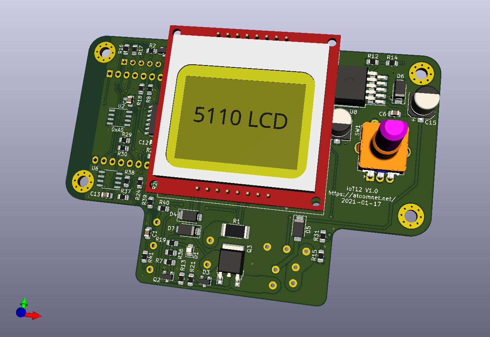

# IoT12-hardware
Schematic and PCB files of the IoT12 solder iron temperature controller for T12 tips.

**Note**: pictured rotary encoder is not the correct type. It should be a EC11 serrated 15mm.

# Status

- [x] Design schematic
- [x] Route PCB
- [x] Slept a few days before ordering PCB
- [x] Ordered PCB
- [x] Made my first github repository
- [ ] PCB arrived
- [ ] Solder first PCB and make solder intructions
- [ ] Make firmware
- [ ] ...
- [ ] profit

At this moment it is unknown if this PCB is going to work or set your house on fire. You should be present at all times when using this circuit.\
There is a safety circuit on the board in case the ESP32 controller decides to die and stuck the heater on permanently. The heater must be turned off and on within 0.5s to keep the safety circuit happy.

# License

 This work is licensed under a <a rel="license" href="http://creativecommons.org/licenses/by-nc/3.0/">Creative Commons Attribution-NonCommercial 3.0 Unported License</a>.